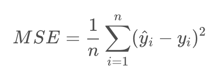
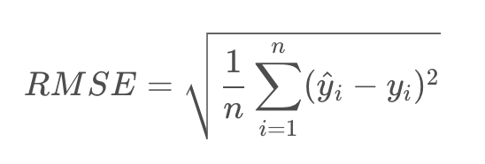
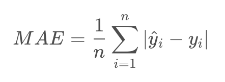
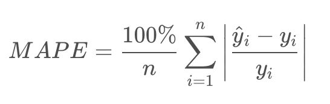

# Scikit-Learn
1. 建立線性多元迴歸的預測模型，繪出散佈圖來比較預測一年後患疾病的定量指標和實際一年後患疾病的定量指標的結果。
2. 建立線性多元迴歸的預測模型，只取 age (年齡)、 sex (性別)、 bmi (Body Mass Index 體質指數)、bp (Average Blood Pressure 平均血壓) 做為解釋變數，產生模型，並繪出散佈圖來比較預測一年後患疾病的定量指標和實際一年後患疾病的定量指標的結果。
3. 算出MES和R2
4. 將資料分割成3:1和4:1的訓練資料集和測試資料集，算出MES和R2

MSE, RMSE, MAE, MPE定義

# MSE（Mean Square Error）

MSE主要以平方來避免誤差正負的互相抵銷，但也因為平方的特性，所以當單一bias大的時候會有懲罰作用，也就是說MSE對於極值（outliers)會相對敏感。

# RMSE（Root Mean Square Error）

RMSE主要就是MSE拿去取根號，取根號的目的是讓他與y的單位變得一致，所以解釋起來會比較直觀！

# MAE（Mean Absolute Error）

抵銷正負誤差的方式，除了平方之外，還有取絕對值，MAE就是取絕對值來計算平均誤差，"相對之下對極值比較不敏感"，如果training data裡面極值很多，那可以考慮用MAE來當作指標。

# MAPE（Mean Absolute Percentage Error）

將誤差轉換為百分比（徹底擺脫單位），主要目的也是解釋起來比較直觀，要記得如果y含有0就不能使用MAPE!

(PS: 個人選擇這個資料來源是因為這個解釋最清楚)
source: https://ithelp.ithome.com.tw/articles/10274551